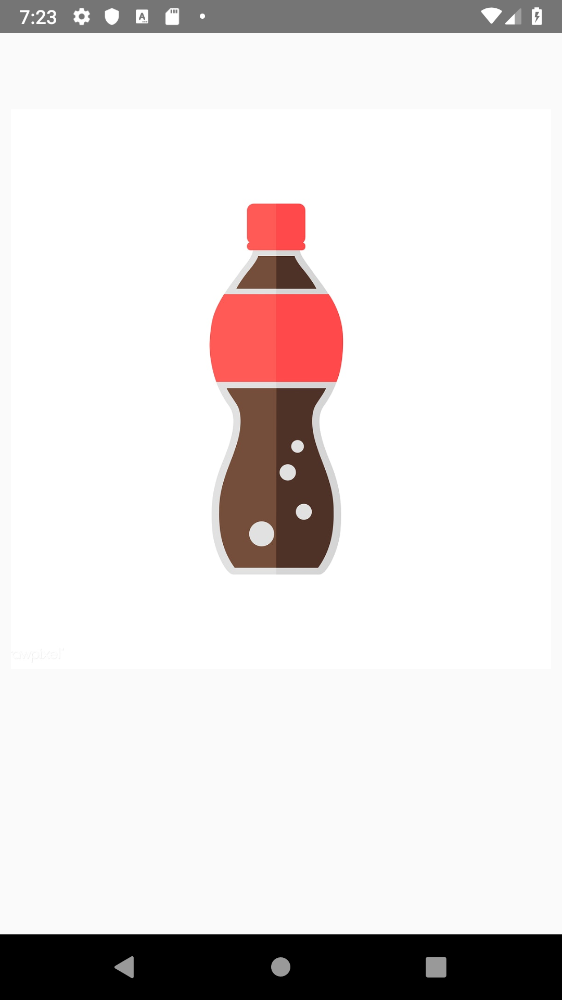

# GameDroid

GameDroid is an Android app for mini motion games. In this app, we have 4 games in total and 2 for each play mode. "Flip the Phone" and "Shake the Soda" for single phone play mods, and "Answer the Phone" and "Roll the Dice" for multiple phone play mode. For our multiple phone play mode games, we support maximum of 6 players(phones) in total.

# Tech Specs

System specs require a android device above android version 21.

## Motion Sensors

Games require's the phone to have a gyroscope and accelerometer to run.

## Nearby Connection

# User Guide

Welcome to our mini games. Please enter your name and hit the LET'S GAME Button.

Playmode Selection Page:

Please select your play mode. Your can choose either Single Player or Multiple players.

Find/Create Room Page:

Please select host or enter your room code if you are a guest.

Game Selection Page:

Please choose your favoured game and hit START!

Game Instruction Page:

See how to play the game and safety instructions.

Game Page:[]

Enjoy your game!

# Game Intro

## Flip the Phone
Flip the phone is a single player game promoting physical activity and fun! Our scoring systems rewards players for
any kind of tricks and moves they preform with their phone. Flip it in your hand or play catch with your friends. The possibilities are endless.

## Shake the Soda
Shake the soda is a party game where players sit around in a circle and pass the phone around. When they get the phone, each player shakes it like a soda as many times as they want. If the soda explodes on you then you lose.

## Answer the Phone
Answer the phone is a multi-player game where each player places their phones face down in front of them. When the phones ring, the first player to flip their phone over wins.

## Roll the Dice
Roll the dice is a deception based party game for all your friends. Take turns rolling dice and making bets on who's the winner by feeling vibrations from your phone.
